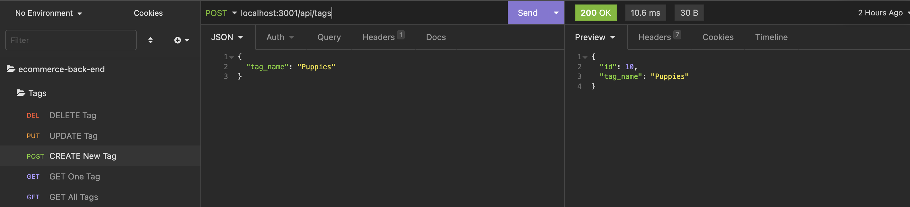
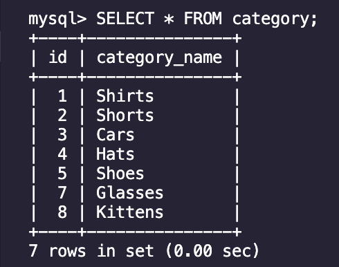
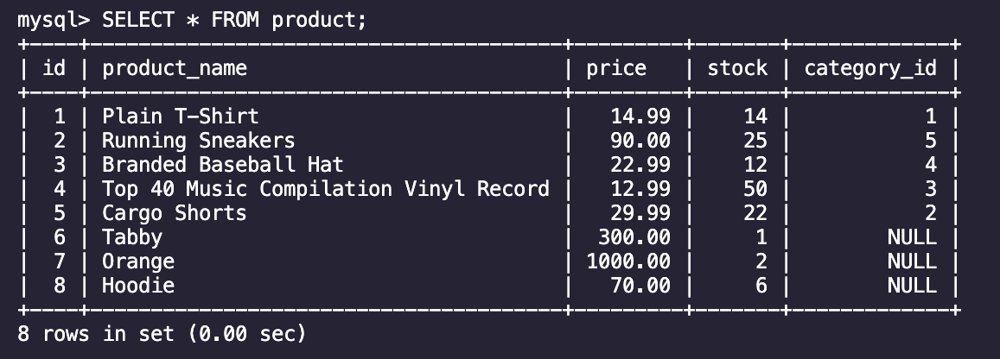
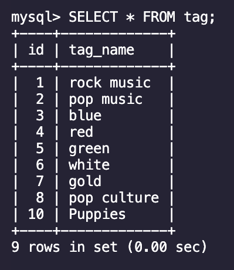
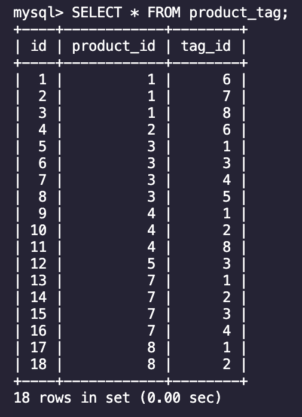
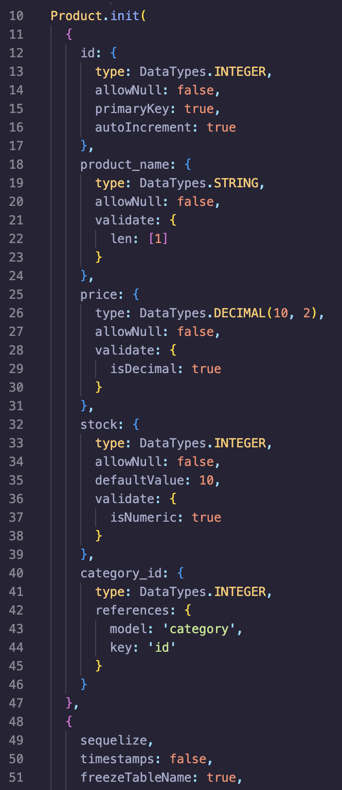
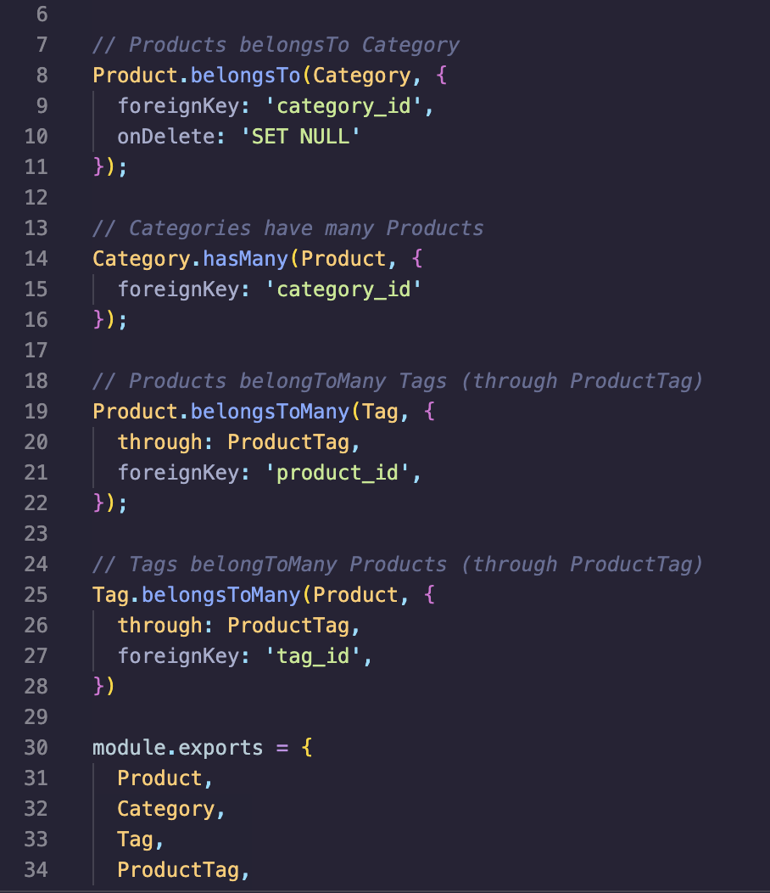
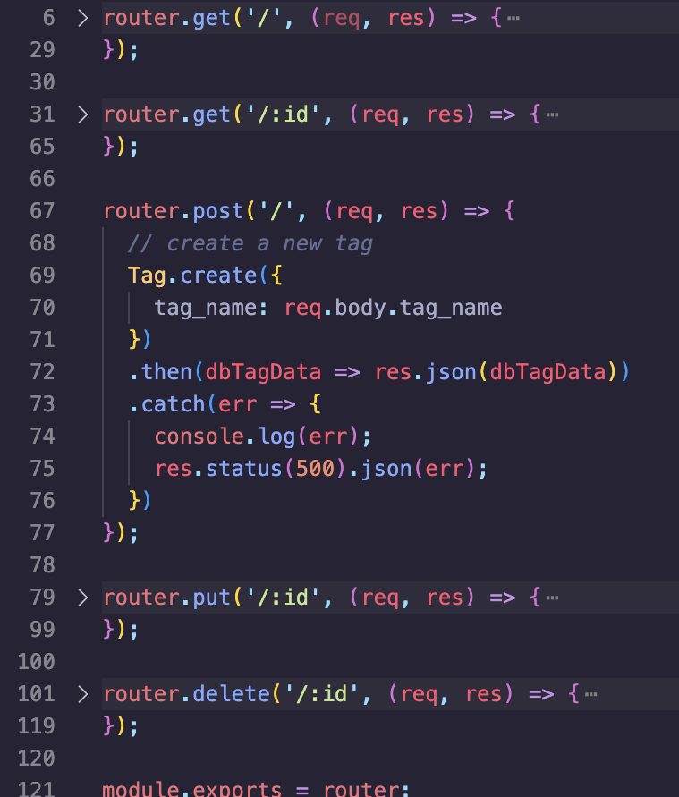
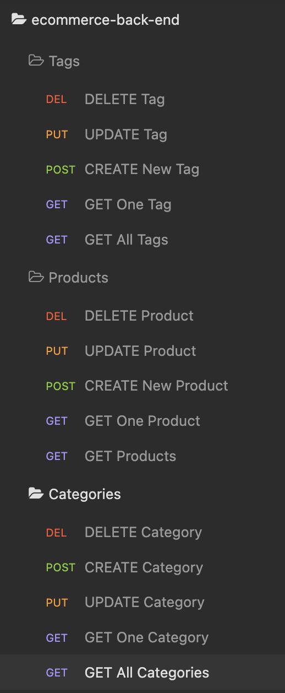

# E-commerce Back End

## License
### 
### [MIT](https://opensource.org/licenses/MIT)

## Description

This is a CLI that displays Categories of products and tags. The user can add new categories, products, and tags, as well as edit and delete them. This product was designed as a launching point for a back end e-commerce site to store and edit their data.

By: [Vincent Toon](https://github.com/vincenttoon)

## Table of Contents

* [Installation](#installation)

* [Usage](#usage)  

* [Contributors](#contributors)

* [Tests](#tests)

* [Future Improvements](#future-improvements)

* [Questions?](#questions)

## Installation

* Head to the repository to download or view this code: [E-commerce Back End](https://github.com/Vincenttoon/ecommerce-back-end)

* Install [NPM](https://www.npmjs.com/): (npm i -y). 
* Install [Insomnia](https://insomnia.rest/) for testing(or another back-end development client). 
* Install [MySQL](https://coding-boot-camp.github.io/full-stack/mysql/mysql-installation-guide). 
* Create and Seed database (node seeds/index.js). 
* Enjoy.

## Tests

[Video demonstration of application:](...)

## Usage

* Uses models and routes to create SQL data and displays the results through a back-end client(Insomnia) where you can test, view, edit and delete information from the database.
 
 
 
 

* Foreign keys are used between the four main tables in the database(Category, Product, Tag, and Product Tag).

* Models use Datatype's through the help of [Sequelize](https://www.npmjs.com/package/sequelize) in Class based formats for data insertion.

* [Routes](https://expressjs.com/en/guide/routing.html) are used to display Class data on specific tables through JSON files.

* Insomnia is then used as a back-end client to examine and manipulate data since there is no front end of this application.

## Contributors

* Starter code repository (given to me through WashU Fullstack Bootcamp): [Xandromus](https://github.com/coding-boot-camp/fantastic-umbrella)

## Future Improvements

* Product and Tag's use foreign id keys to get information from other table. While functional, most users(myself included) will not know what (product_key: 1) represents without having it in front of them. Making them share name values would be more beneficial for the user.

## Questions?

Questions, comments, or concerns? Please Email me at:
* vincenttoon22@gmail.com